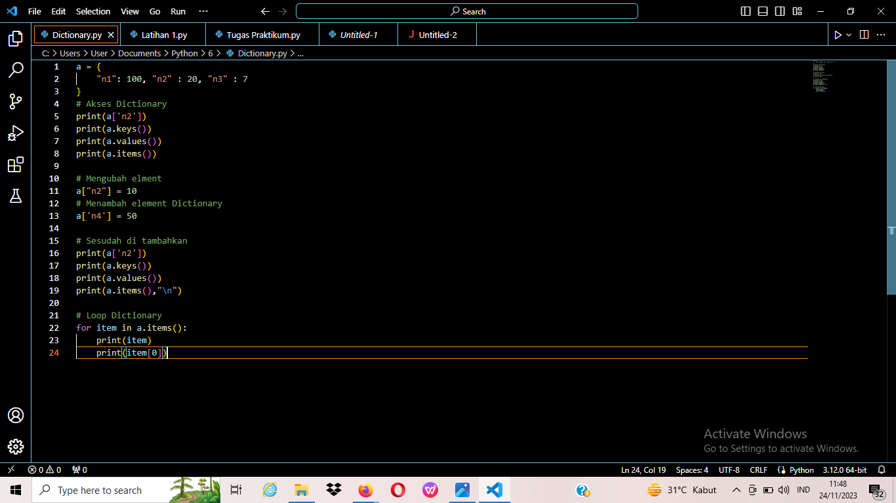
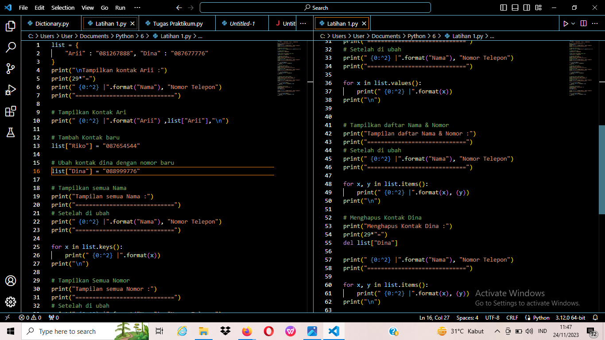
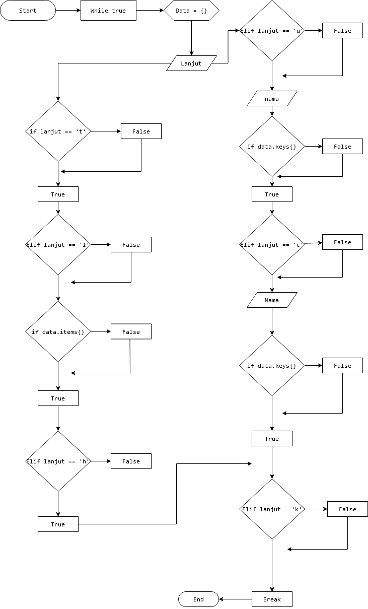

# PRAKTIKUM10

## LATIHAN1

 • Buat Dictionary daftar kontak

 • Nama sebagai key, dan nomor sebagai value

 • Tampilkan kontaknya Ari

 • Tambah kontak baru dengan nama Riko, nomor 087654544

 • Ubah kontak Dina dengan nomor baru 088999776

 • Tampilkan semua Nama

 • Tampilkan semua Nomor

 • Tampilkan daftar Nama dan nomornya

 • Hapus kontak Dina.

## TUGAS PRAKTIKUM

 Buat program sederhana yang akan menampilkan daftar nilai mahasiswa, dengan ketentuan

 • Program dibuat dengan menggunakan Dictionary

 • Tampilkan menu pilihan: (Tambah Data, Ubah Data, Hapus Data, Tampilkan Data, Cari Data)

 • Nilai Akhir diambil dari perhitungan 3 komponen nilai (tugas: 30%, uts: 35%, uas: 35%)

 • Buat flowchart dan penjelasan programnya pada README.md.

